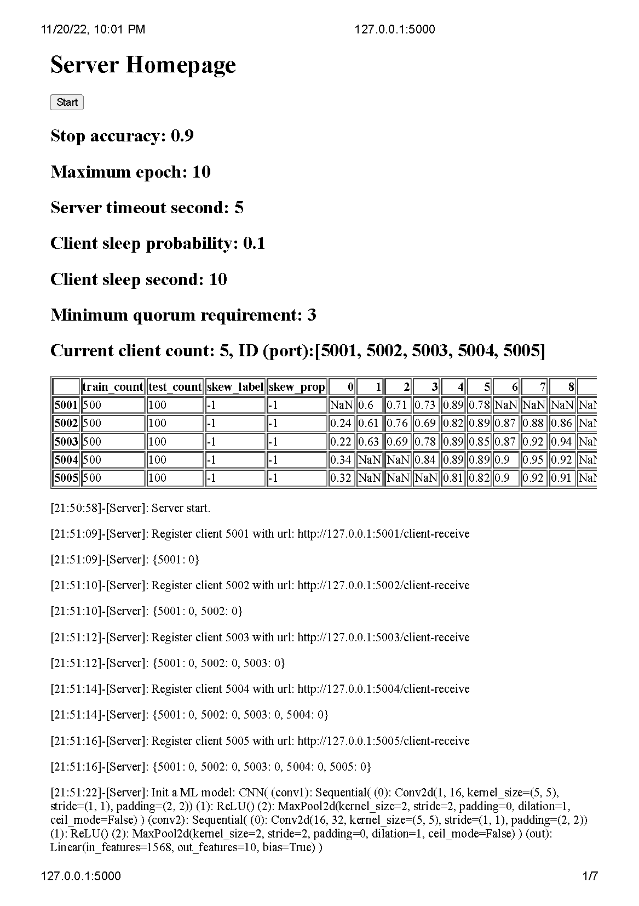
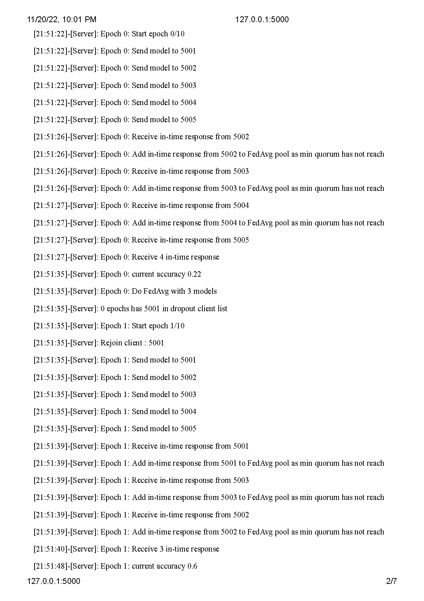
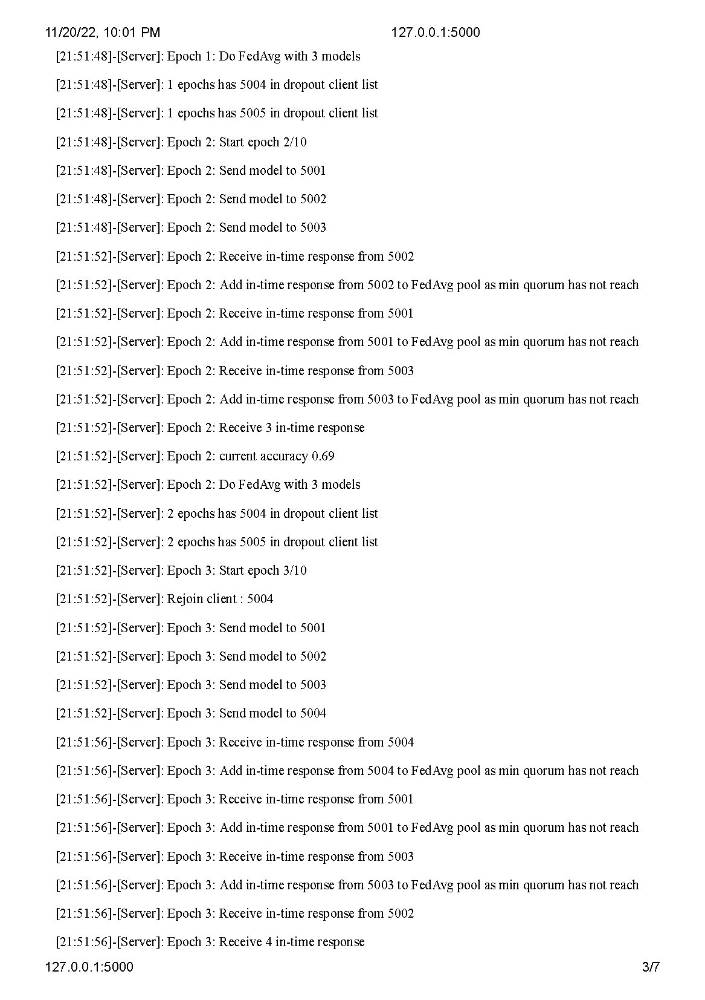
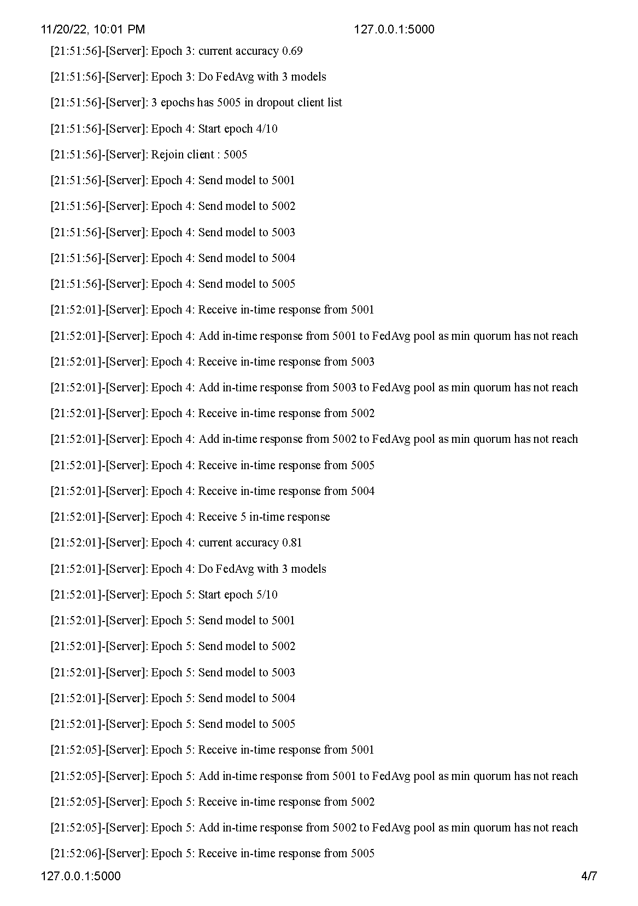

# fl

## How to run

1. `cd` to project folder
2. To start a server, run
    ```shell
   python -m server
    ```
3. To start a client, run following command in a new terminal session. 
    ```shell
   python -m client 5001
    ```
4. To start multiple clients, run above command with different port number, for example 5001, 5002, etc. 
5. Open the website for server and all clients. Click `register` on each client homepage.

6. Refresh the server homepage, and you will see registered clients. Click `start` to start the federated learning.


## Screenshot

Following is an example running with timeout, quorum setting and client dropout and rejoin.

Basic setting can be found in the first few lines before the table. 

The table is a record of the federated learning process. At each epoch, first responses making up the quorum are recorded in the table. The table cell of each client at each epoch is the accuracy of local training. `NaN` means the response is either late or exceed the quorum number.

For example, epoch 0 proceeds with 4 in-time responses from client 5002, 5003, 5004 and 5005. 

Epoch 9 has only 0 in-time responses. The learning aborts.

We can also see some clients drop and rejoin after as its accuracy is NaN at earlier epoch and a value later.







